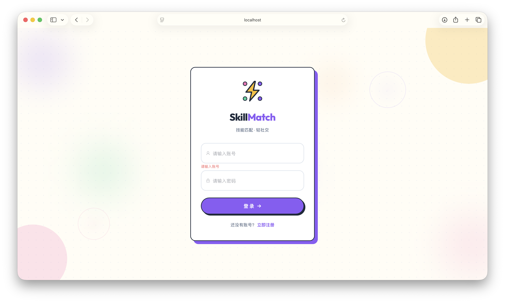
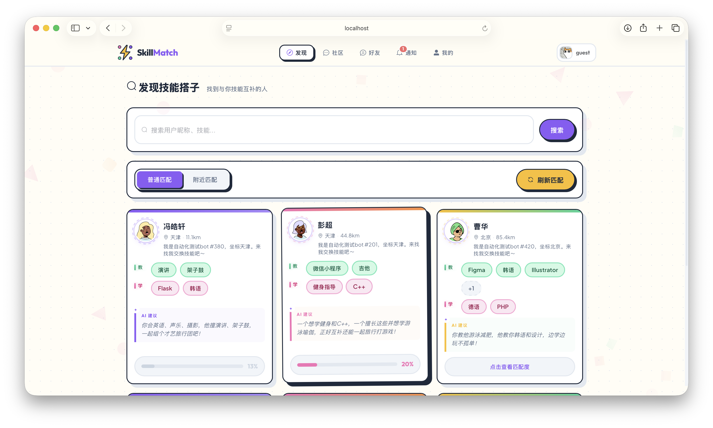
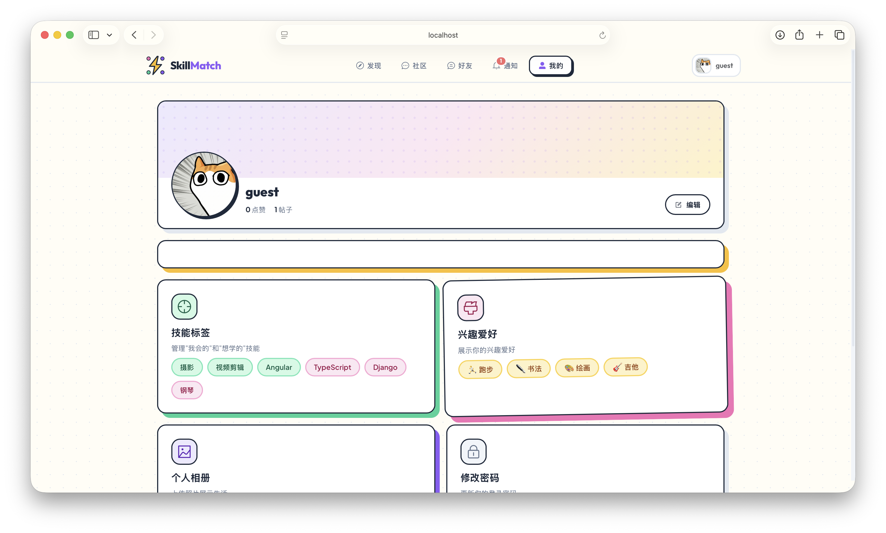
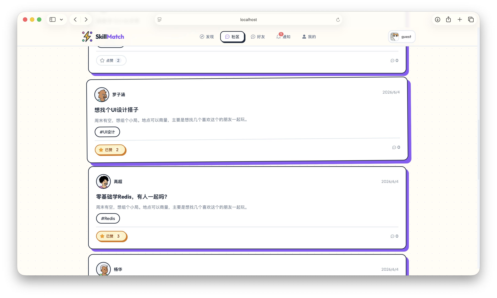
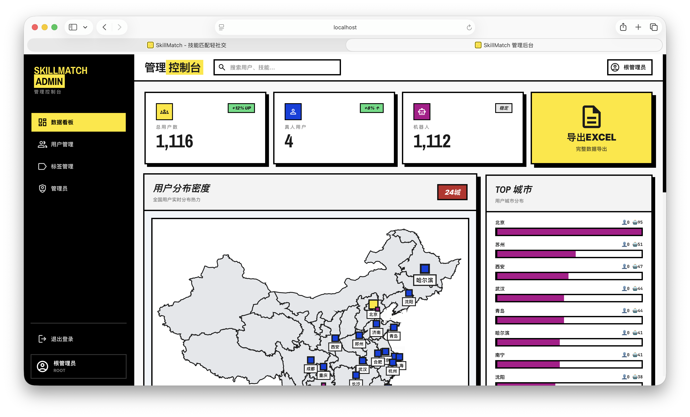
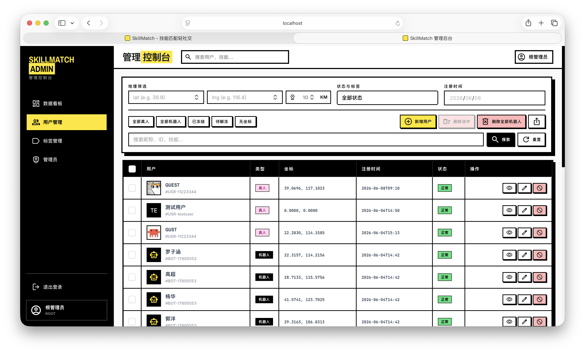

# SkillMatch

> 基于技能互补与语义匹配的智能社交平台

## 简介

SkillMatch 是一个面向技能型社交的全栈 Web 应用。与传统"兴趣相同即推荐"的社交平台不同，SkillMatch 的核心理念是 **技能互补** —— 我会 Java，你想学 Java；你会 Python，我想学 Python —— 通过双向互补匹配，让社交关系产生真正的价值交换。

平台集成了 **SentenceTransformer 语义匹配引擎**，能够理解用户简介、技能和爱好的深层语义，实现"Java 开发 ≈ SpringBoot 工程师"级别的智能推荐，而非简单的关键词匹配。

### 核心亮点

- **技能互补推荐** — 不仅匹配兴趣相同的人，更发现技能互补的搭档
- **语义向量匹配** — 基于 SentenceTransformer (BAAI/bge-m3) 生成语义向量，余弦相似度计算匹配度
- **Redis GEO 空间召回** — 地理位置感知，提高匹配结果的现实可达性
- **多层匹配流水线** — 召回 → 过滤 → 粗排 → 精排，兼顾效率与精度
- **优雅降级** — AI 服务不可用时自动回退到规则匹配，保障系统可用性

## 项目展示

### 登录与注册
<p align="center">
  
</p>

### 智能匹配主页
<p align="center">
  
</p>

> 基于技能互补 + 语义相似度 + 地理位置的多维智能推荐，支持全站用户搜索

### 用户个人页
<p align="center">
  
</p>

> 个人资料、技能标签（我会的 / 我想学的）、兴趣爱好、相册展示

### 社区广场
<p align="center">
  
</p>

> 发帖、评论、点赞、标签筛选

### 管理控制台
<p align="center">
  
  
</p>

> ECharts 可视化图表、用户管理、标签管理、机器人管理

## 技术栈

### 后端

| 技术 | 版本 | 用途 |
|------|------|------|
| Java | 21 | 编程语言 |
| Spring Boot | 3.3.2 | Web 框架 |
| MyBatis-Plus | 3.5.9 | ORM + 分页插件 |
| MySQL | 8.0 | 关系型数据库 |
| Redis | 7.0 | 缓存 / Token / GEO 空间索引 |
| JWT (jjwt) | 0.13.0 | 用户认证 |
| WebSocket | — | 实时聊天 |
| 阿里云 OSS | 3.18.4 | 文件存储 |
| Hutool | 5.8.44 | Java 工具库 |

### AI 引擎

| 技术 | 版本 | 用途 |
|------|------|------|
| FastAPI | 0.115.0 | 异步 Web 框架 |
| SentenceTransformers | 3.0 | 语义向量模型 (BAAI/bge-m3) |
| PyTorch | 2.0+ | 深度学习框架 |
| Redis | 5.0 | 向量缓存 |

### 前端

| 技术 | 用户端 | 管理后台 | 用途 |
|------|--------|---------|------|
| Vue | 3.4 | 3.4 | 前端框架 |
| Vite | 5.4 | 5.4 | 构建工具 |
| UI 库 | Element Plus 2.7 | PrimeVue 4.5 | 组件库 |
| 状态管理 | Pinia 2.1 | Pinia 2.1 | 全局状态 |
| HTTP | Axios 1.7 | Axios 1.7 | 请求封装 |
| 图表 | — | ECharts 5.5 | 数据可视化 |
| 导出 | — | XLSX 0.18 | Excel 导出 |

## 功能模块

### 用户端

| 模块 | 功能 |
|------|------|
| 用户系统 | 注册、登录、资料编辑、修改密码、头像上传 |
| 技能管理 | 添加/管理"我会的"和"我想学的"技能标签 |
| 兴趣爱好 | 添加/管理兴趣标签 |
| 相册展示 | 图片上传至 OSS，个人相册管理 |
| 智能匹配 | 发现页双模式（普通匹配 / 附近匹配），技能互补 + 兴趣重叠 + AI 精排 |
| AI 建议 | 每张匹配卡片展示 AI 生成的推荐理由（规则兜底 + LLM 异步覆盖） |
| 匹配解释 | LLM 生成自然语言匹配原因，帮助理解"为什么推荐这个人" |
| 全站搜索 | 按昵称、技能关键词搜索全站用户 |
| 社区广场 | 发帖、评论、点赞、标签筛选 |
| 好友系统 | 技能交换请求、好友列表管理 |
| 即时通讯 | WebSocket 一对一实时聊天 |
| 通知系统 | 点赞通知、交换请求通知 |

### 管理后台

| 模块 | 功能 |
|------|------|
| 数据仪表盘 | 用户增长趋势、活跃度统计、ECharts 图表 |
| 用户管理 | 用户列表查询、地理位置筛选、状态启禁用 |
| 机器人管理 | 批量创建/删除测试用户 |
| 标签管理 | 技能/兴趣标签的增删改查、分类管理 |
| 管理员管理 | 管理员账号管理、ROOT/ADMIN 权限控制 |

## 匹配算法

系统包含 **两套匹配流程**：

### 发现页匹配（`getDiscoverUsers`）

发现页支持两种模式，每次返回 6 张用户卡片：

| 模式 | 召回方式 | 说明 |
|------|---------|------|
| 普通匹配 | 全库按最近活跃取 200 人 | 不限距离，发现更多用户 |
| 附近匹配 | Redis GEO 100km 半径搜索 | 基于地理位置，提高现实可达性 |

流程：召回 → 排除（自己/好友/已请求/已展示） → 规则打分 → 取 Top 30 随机选 6 人 → AI 建议（后端规则兜底 + 前端 LLM 覆盖）

### 分页匹配（`getRecommendedUsers`）

采用 **四阶段流水线** 架构：

```
候选用户池
    │
    ▼
┌─────────────────────────────────┐
│  1. Geo 空间召回（Redis GEO）    │  ← 按距离筛选附近用户（上限 200）
└──────────────┬──────────────────┘
               ▼
┌─────────────────────────────────┐
│  2. 过滤层                       │  ← 排除自己、已有好友、待处理请求
└──────────────┬──────────────────┘
               ▼
┌─────────────────────────────────┐
│  3. 规则粗排                     │  ← 技能互补度 × 0.7 + 兴趣重叠度 × 0.3
└──────────────┬──────────────────┘
               ▼
┌─────────────────────────────────┐
│  4. AI 精排（≥20 候选时触发）     │  ← 语义 + 互补 + 兴趣 融合打分
└──────────────┬──────────────────┘
               ▼
          最终推荐结果
```

### 规则粗排（Java 端）

```
canTeachRatio = 我会的 ∩ 你想学的 / 你想学的总数
canLearnRatio = 你会的 ∩ 我想学的 / 我想学的总数
skillComplement = (canTeachRatio + canLearnRatio) / 2 × 100

hobbyOverlap = 共同兴趣数 / 双方兴趣并集 × 100   (Jaccard 相似系数)

ruleScore = skillComplement × 0.7 + hobbyOverlap × 0.3
```

技能互补占 70%，兴趣重叠占 30%，满分 100。

### AI 精排（Python 端）

当候选人数 ≥ 20 时，调用 Python AI 引擎进行精排。AI 引擎融合三个维度：

```
score = 语义相似度 × 0.3 + 技能互补 × 0.4 + 兴趣重叠 × 0.3
```

| 维度 | 权重 | 计算方式 |
|------|------|----------|
| 语义相似度 | 30% | SentenceTransformer 编码用户文本，余弦相似度 |
| 技能互补 | 40% | (我会的 ∩ 你想学 + 你想学 ∩ 我会的) / 总技能数 |
| 兴趣重叠 | 30% | 共同兴趣数 / 我的兴趣数 |

### 最终融合

```
finalScore = ruleScore × 0.6 + aiScore × 40
```

- `ruleScore` 范围 0-100，`aiScore` 范围 0-1
- 最终得分 = 规则分 × 60% + AI 分 × 40%，满分 100

### 降级策略

- 候选人数 < 20：跳过 AI 精排，直接使用规则分
- AI 服务不可用：捕获异常，降级使用规则分

## 系统架构

```
┌─────────────┐     ┌─────────────┐
│   用户端     │     │  管理后台    │
│ Vue3 + EPlus│     │ Vue3 + PV   │
│   :3000     │     │   :3001     │
└──────┬──────┘     └──────┬──────┘
       └─────────┬─────────┘
          ┌──────▼──────┐
          │  Spring Boot │
          │    :8080     │
          └──────┬──────┘
       ┌─────────┼─────────┐
┌──────▼──────┐     ┌──────▼──────┐
│  MySQL 8.0  │     │   Redis 7.0 │
│  15 张数据表 │     │ Token/GEO   │
└─────────────┘     └──────┬──────┘
                    ┌──────▼──────┐
                    │  AI 引擎    │
                    │  FastAPI    │
                    │   :8000     │
                    └─────────────┘
```

**认证流程：** 登录 → JWT Token 存入 Redis → 前端携带 Token → 拦截器解析校验 → userId 写入 ThreadLocal

**响应规范：** 统一 `RESTful<T>` 封装，code=200 成功，BusinessException 统一异常处理

## 项目结构

```
skillMatch/
├── src/main/java/com/skillmatch/
│   ├── controller/         # REST 接口（17 个 Controller）
│   ├── service/            # 业务逻辑接口 + 实现
│   ├── mapper/             # MyBatis-Plus Mapper
│   ├── domain/             # PO / DTO / VO / Query
│   ├── client/             # AI 引擎 HTTP 客户端
│   ├── config/             # Spring 配置
│   ├── interceptor/        # JWT 认证拦截器
│   ├── context/            # UserContext（ThreadLocal）
│   ├── ws/                 # WebSocket（聊天）
│   ├── annotation/         # 自定义注解
│   ├── constants/          # 常量定义
│   ├── enums/              # 枚举类
│   ├── exceptions/         # 自定义异常
│   ├── validator/          # 参数校验器
│   └── utils/              # JwtUtil、OssUtil、GeoUtil
├── src/main/resources/
│   ├── mapper/             # MyBatis XML（9 个）
│   └── application.yaml    # 配置文件
├── ai-engine/              # AI 语义匹配引擎
│   ├── app.py              # FastAPI 入口
│   ├── services/           # matcher + embedder
│   └── requirements.txt
├── frontend/               # 用户端（Vue 3 + Element Plus）
├── admin-frontend/         # 管理后台（Vue 3 + PrimeVue）
├── docs/                   # 文档
└── screenshots/            # 项目截图
```

## 数据库

共 15 张表：

| 表名 | 说明 |
|------|------|
| `user` | 用户基础信息 |
| `admin_user` | 管理员账号（ROOT/ADMIN） |
| `skill_tag` | 技能标签字典 |
| `hobby_tag` | 兴趣标签字典 |
| `user_skill` | 用户技能关联（1=我会, 2=想学） |
| `user_hobby` | 用户兴趣关联 |
| `user_gallery` | 用户相册 |
| `post` | 社区帖子 |
| `post_comment` | 帖子评论 |
| `post_tag` | 帖子标签关联 |
| `friend` | 好友关系 |
| `contact_request` | 技能交换请求 |
| `chat_message` | 聊天消息 |
| `like_info` | 点赞记录 |
| `notification` | 通知消息 |

## 快速开始

### 环境要求

| 依赖 | 版本 | 说明 |
|------|------|------|
| JDK | 21+ | 推荐 [Eclipse Temurin](https://adoptium.net/) |
| Maven | 3.8+ | 构建工具 |
| Node.js | 18+ | 前端运行环境 |
| Python | 3.10+ | AI 引擎运行环境 |
| MySQL | 8.0+ | 关系型数据库 |
| Redis | 7.0+ | 缓存 / GEO 空间索引 |

### 1. 克隆项目

```bash
git clone https://github.com/your-username/skillMatch.git
cd skillMatch
```

### 2. 配置环境变量

```bash
cp .env.example .env
```

编辑 `.env` 文件，填写实际配置。**必填项：**

| 变量 | 说明 |
|------|------|
| `MYSQL_HOST` / `MYSQL_PORT` / `MYSQL_USERNAME` / `MYSQL_PASSWORD` | MySQL 连接信息 |
| `REDIS_HOST` / `REDIS_PORT` | Redis 连接信息 |
| `GAODE_API_KEY` | 高德地图 API，[申请地址](https://console.amap.com/) |

**选填项（不配置不影响核心功能）：**

| 变量 | 说明 |
|------|------|
| `AI_ENGINE_URL` | AI 引擎地址，默认 `http://localhost:8000` |
| `OSS_ACCESS_KEY_ID` / `OSS_ACCESS_KEY_SECRET` | 阿里云 OSS，头像/图片上传需要 |
| `LLM_API_KEY` | LLM API Key，匹配解释和 AI 建议功能需要 |
| `LLM_BASE_URL` / `LLM_MODEL` | LLM 接口地址和模型名，默认 DeepSeek |
| `AI_EMBEDDING_MODEL` | SentenceTransformer 模型名，默认 `BAAI/bge-m3` |

> 💡 完整配置项及说明见 `.env.example`

### 3. 初始化数据库

```bash
# 创建数据库
mysql -u root -p -e "CREATE DATABASE IF NOT EXISTS skill_match DEFAULT CHARACTER SET utf8mb4;"

# 导入表结构和初始数据
mysql -u root -p skill_match < src/main/resources/skill_match.sql
```

默认管理员账号：`admin` / `123456`

### 4. 启动 AI 引擎

```bash
cd ai-engine
pip install -r requirements.txt
python app.py
```

> ⚠️ 首次启动会自动下载 SentenceTransformer 模型（约 90MB），请确保网络通畅。如国内网络慢，可设置 Hugging Face 镜像：
> ```bash
> export HF_ENDPOINT=https://hf-mirror.com
> ```

### 5. 启动后端

```bash
# 回到项目根目录
cd ..
mvn spring-boot:run
```

> 💡 确保 MySQL 和 Redis 已启动，且 `.env` 配置正确。

### 6. 启动前端

```bash
# 用户端（新终端）
cd frontend && npm install && npm run dev

# 管理后台（新终端）
cd admin-frontend && npm install && npm run dev
```

### 服务端口

| 服务 | 端口 | 访问地址 |
|------|------|----------|
| Spring Boot 后端 | 8080 | http://localhost:8080 |
| AI 引擎 | 8000 | http://localhost:8000/docs |
| 用户端前端 | 3000 | http://localhost:3000 |
| 管理后台 | 3001 | http://localhost:3001 |

### 常见问题

**Q: AI 引擎启动报错 `ModuleNotFoundError`**
A: 确保在 `ai-engine` 目录下执行 `pip install -r requirements.txt`

**Q: 后端启动报错 `Communications link failure`**
A: 检查 MySQL 是否启动，`.env` 中数据库配置是否正确

**Q: 后端启动报错 `Connection refused` for Redis**
A: 检查 Redis 是否启动：`redis-cli ping` 应返回 `PONG`

**Q: 前端启动报错 `ECONNREFUSED`**
A: 后端未启动或端口不对，确保后端在 8080 端口运行

**Q: 国内下载 Python 包很慢**
A: 使用国内镜像源：
```bash
pip install -r requirements.txt -i https://pypi.tuna.tsinghua.edu.cn/simple
```
## API 文档

- OpenAPI 规范：`docs/skillmatch-openapi.json`
- AI 引擎：启动后访问 `http://localhost:8000/docs`

## 常用命令

```bash
# 后端
mvn compile && mvn test && mvn package

# AI 引擎
cd ai-engine && python app.py

# 前端
cd frontend && npm run dev       # 开发
cd frontend && npm run build     # 构建
```

## 许可证

本项目仅供学习交流使用。

## 联系作者
> ***邮箱：a2540897610@163.com***